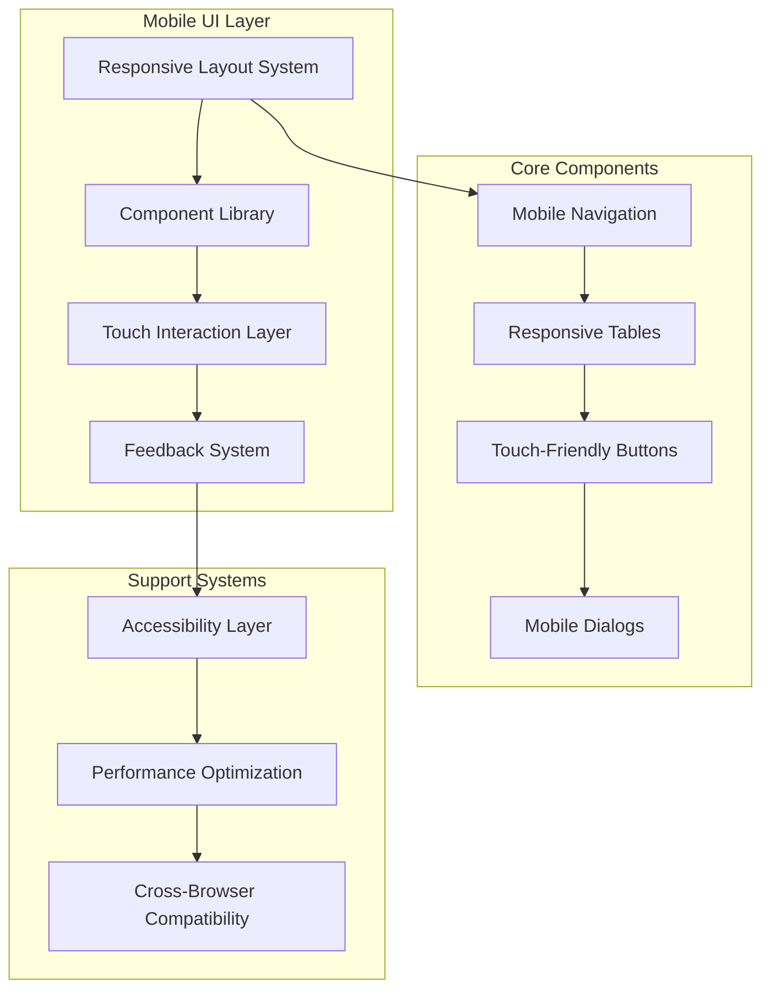

# Design Document - Melhorias UI/UX Mobile HealthCore

## Overview

Este documento detalha o design técnico para implementar melhorias abrangentes de UI/UX mobile no sistema HealthCore. O design combina análise de requisitos estruturados com especificações técnicas detalhadas, visando elevar a experiência mobile ao mesmo nível de qualidade da versão desktop.

O sistema atual apresenta excelente performance em desktop mas sofre com problemas críticos em dispositivos móveis. Esta solução implementa padrões modernos de UI/UX mobile, seguindo guidelines de Material Design e Apple Human Interface Guidelines, com foco especial no iPhone 11 (390x844px) como referência.

## Architecture

### High-Level Architecture



### Component Hierarchy

```
MobileUISystem/
├── Navigation/
│   ├── HamburgerMenu
│   ├── MobileDrawer
│   └── NavigationOverlay
├── DataDisplay/
│   ├── ResponsiveTable
│   ├── ScrollIndicators
│   └── StickyColumns
├── Interaction/
│   ├── TouchButton
│   ├── RippleEffect
│   └── HapticFeedback
├── Dialogs/
│   ├── MobileDialog
│   ├── SwipeGestures
│   └── FormOptimization
├── Feedback/
│   ├── SkeletonScreens
│   ├── ToastSystem
│   ├── EmptyStates
│   └── LoadingStates
└── Accessibility/
    ├── ARIASupport
    ├── KeyboardNavigation
    └── ScreenReaderOptimization
```

## Components and Interfaces

### 1. Mobile Navigation System

#### HamburgerMenu Component
```typescript
interface HamburgerMenuProps {
  isOpen: boolean;
  onToggle: () => void;
  size?: 'small' | 'medium' | 'large';
  animationDuration?: number;
  ariaLabel?: string;
}

interface HamburgerMenuState {
  isAnimating: boolean;
  touchStartY: number;
  isDragging: boolean;
}

class HamburgerMenu extends Component<HamburgerMenuProps, HamburgerMenuState> {
  // Implementa botão hambúrguer com animação X
  // Área de toque mínima: 44px x 44px
  // Animação de transformação: 300ms ease-in-out
  // Estados: closed, opening, open, closing
}
```

#### MobileDrawer Component
```typescript
interface MobileDrawerProps {
  isOpen: boolean;
  onClose: () => void;
  menuItems: MenuItem[];
  width?: number;
  position?: 'left' | 'right';
  overlay?: boolean;
  swipeToClose?: boolean;
}

interface MenuItem {
  id: string;
  label: string;
  icon: React.ReactNode;
  path?: string;
  children?: MenuItem[];
  roles?: UserProfile[];
  badge?: string | number;
}
```

**Design Specifications:**
- **Width**: 280px (70% da tela em mobile)
- **Animation**: Slide-in from left, 300ms cubic-bezier(0.4, 0, 0.2, 1)
- **Overlay**: Semi-transparent black (rgba(0,0,0,0.5))
- **Z-index**: 1000 (acima de todo conteúdo)
- **Scroll**: Vertical interno quando necessário
- **Gestures**: Swipe right para fechar, tap overlay para fechar

### 2. Responsive Table System

#### ResponsiveTable Component
```typescript
interface ResponsiveTableProps<T> {
  data: T[];
  columns: ColumnDefinition<T>[];
  keyField: keyof T;
  stickyColumns?: string[];
  mobileBreakpoint?: number;
  virtualScrolling?: boolean;
  onRowClick?: (row: T) => void;
  loading?: boolean;
  emptyState?: React.ReactNode;
}

interface ColumnDefinition<T> {
  id: keyof T;
  label: string;
  width?: string | number;
  minWidth?: number;
  sticky?: boolean;
  hideOnMobile?: boolean;
  sortable?: boolean;
  formatter?: (value: any, row: T) => React.ReactNode;
  align?: 'left' | 'center' | 'right';
}
```

**Design Specifications:**
- **Container**: overflow-x: auto, -webkit-overflow-scrolling: touch
- **Sticky Columns**: position: sticky, left: 0, z-index: 10
- **Scroll Indicators**: Box-shadow gradients nas bordas
- **Performance**: Virtual scrolling para > 100 linhas
- **Touch**: Smooth scrolling, momentum preservado

#### Table Configuration by Entity
```typescript
const TableConfigurations = {
  patients: {
    stickyColumns: ['nome', 'documento'],
    mobileColumns: ['nome', 'documento', 'telefone', 'acoes'],
    tabletColumns: ['nome', 'documento', 'telefone', 'email', 'medico', 'acoes'],
    desktopColumns: 'all'
  },
  doctors: {
    stickyColumns: ['nome', 'crm'],
    mobileColumns: ['nome', 'crm', 'especialidade', 'acoes'],
    tabletColumns: ['nome', 'crm', 'especialidade', 'telefone', 'acoes'],
    desktopColumns: 'all'
  },
  exams: {
    stickyColumns: ['paciente', 'data'],
    mobileColumns: ['paciente', 'data', 'tipo', 'status', 'acoes'],
    tabletColumns: ['paciente', 'data', 'tipo', 'medico', 'status', 'acoes'],
    desktopColumns: 'all'
  }
};
```

### 3. Touch-Friendly Button System

#### TouchButton Component
```typescript
interface TouchButtonProps {
  variant: 'primary' | 'secondary' | 'tertiary' | 'danger' | 'ghost';
  size: 'small' | 'medium' | 'large';
  fullWidth?: boolean;
  disabled?: boolean;
  loading?: boolean;
  startIcon?: React.ReactNode;
  endIcon?: React.ReactNode;
  ripple?: boolean;
  hapticFeedback?: 'light' | 'medium' | 'heavy';
  onClick?: (event: React.MouseEvent) => void;
  children: React.ReactNode;
}

interface ButtonMetrics {
  minTouchArea: { width: number; height: number };
  padding: { x: number; y: number };
  fontSize: number;
  borderRadius: number;
}
```

**Design Specifications:**
```typescript
const ButtonSizes: Record<string, ButtonMetrics> = {
  small: {
    minTouchArea: { width: 44, height: 44 },
    padding: { x: 16, y: 8 },
    fontSize: 14,
    borderRadius: 6
  },
  medium: {
    minTouchArea: { width: 48, height: 48 },
    padding: { x: 20, y: 12 },
    fontSize: 16,
    borderRadius: 8
  },
  large: {
    minTouchArea: { width: 56, height: 56 },
    padding: { x: 24, y: 16 },
    fontSize: 18,
    borderRadius: 10
  }
};
```

#### RippleEffect System
```typescript
interface RippleEffectProps {
  color?: string;
  duration?: number;
  disabled?: boolean;
}

class RippleEffect {
  // Implementa efeito ripple Material Design
  // Calcula posição baseada no ponto de toque
  // Animação: scale(0) -> scale(4), opacity: 0.3 -> 0
  // Duração: 600ms
  // Cleanup automático após animação
}
```

### 4. Mobile Dialog System

#### MobileDialog Component
```typescript
interface MobileDialogProps {
  isOpen: boolean;
  onClose: () => void;
  title: string;
  size?: 'sm' | 'md' | 'lg' | 'fullscreen';
  mobileFullscreen?: boolean;
  swipeToClose?: boolean;
  children: React.ReactNode;
  actions?: DialogAction[];
}

interface DialogAction {
  label: string;
  onClick: () => void;
  variant?: 'primary' | 'secondary' | 'danger';
  loading?: boolean;
  disabled?: boolean;
}
```

**Design Specifications:**
- **Mobile Layout**: Fullscreen (100vw x 100vh)
- **Desktop Layout**: Centered modal com max-width
- **Header**: Sticky, 64px height, título + botão fechar
- **Content**: Flex-grow, overflow-y: auto, padding: 16px
- **Footer**: Sticky, padding: 16px, botões alinhados à direita
- **Animation**: Slide-up (mobile), fade-in (desktop)

#### SwipeGestures Hook
```typescript
interface SwipeGesturesConfig {
  threshold: number; // Porcentagem da tela para trigger
  velocity: number;  // Velocidade mínima
  direction: 'vertical' | 'horizontal' | 'both';
}

const useSwipeGestures = (
  onSwipe: (direction: SwipeDirection) => void,
  config: SwipeGesturesConfig
) => {
  // Implementa detecção de gestos touch
  // Calcula velocidade e distância
  // Trigger callbacks baseado em thresholds
  // Suporte a rubber band effect
};
```

### 5. Feedback and Loading System

#### SkeletonScreen Component
```typescript
interface SkeletonProps {
  width?: string | number;
  height?: string | number;
  variant?: 'text' | 'rectangular' | 'circular';
  animation?: 'pulse' | 'wave' | 'none';
  lines?: number;
  className?: string;
}

interface SkeletonScreenConfig {
  component: string;
  layout: SkeletonElement[];
  responsive: {
    mobile: number;
    tablet: number;
    desktop: number;
  };
}

interface SkeletonElement {
  type: 'text' | 'avatar' | 'button' | 'card';
  width: string;
  height: string;
  position?: { x: number; y: number };
}
```

#### Toast Notification System
```typescript
interface ToastProps {
  id: string;
  type: 'success' | 'error' | 'warning' | 'info';
  title: string;
  message?: string;
  duration?: number;
  position?: ToastPosition;
  action?: ToastAction;
  dismissible?: boolean;
}

interface ToastPosition {
  vertical: 'top' | 'bottom';
  horizontal: 'left' | 'center' | 'right';
  offset?: { x: number; y: number };
}

interface ToastAction {
  label: string;
  onClick: () => void;
  style?: 'button' | 'link';
}
```

**Design Specifications:**
- **Position**: Top-right (desktop), bottom-center (mobile)
- **Max Toasts**: 5 simultâneos
- **Auto-dismiss**: 4s (success), 6s (error), 8s (warning)
- **Animation**: Slide-in + fade, spring physics
- **Stacking**: Vertical com 8px gap

## Data Models

### UI State Management

```typescript
interface UIState {
  navigation: NavigationState;
  tables: TableState;
  dialogs: DialogState;
  feedback: FeedbackState;
  accessibility: AccessibilityState;
}

interface NavigationState {
  sidebarOpen: boolean;
  currentRoute: string;
  breadcrumbs: Breadcrumb[];
  mobileMenuOpen: boolean;
}

interface TableState {
  [tableId: string]: {
    sortColumn?: string;
    sortDirection: 'asc' | 'desc';
    filters: Record<string, any>;
    selectedRows: string[];
    scrollPosition: number;
  };
}

interface DialogState {
  openDialogs: string[];
  dialogData: Record<string, any>;
  formStates: Record<string, FormState>;
}

interface FeedbackState {
  toasts: Toast[];
  loadingStates: Record<string, boolean>;
  errors: Record<string, string>;
}

interface AccessibilityState {
  highContrast: boolean;
  reducedMotion: boolean;
  screenReaderMode: boolean;
  keyboardNavigation: boolean;
}
```

### Responsive Breakpoints

```typescript
const Breakpoints = {
  xs: 0,      // Extra small devices
  sm: 600,    // Small devices (landscape phones)
  md: 900,    // Medium devices (tablets)
  lg: 1200,   // Large devices (desktops)
  xl: 1536    // Extra large devices
} as const;

const MobileBreakpoint = 768; // Ponto de corte principal mobile/desktop

interface ResponsiveConfig<T> {
  xs?: T;
  sm?: T;
  md?: T;
  lg?: T;
  xl?: T;
}
```

### Theme and Design Tokens

```typescript
interface MobileTheme {
  colors: ColorPalette;
  typography: TypographyScale;
  spacing: SpacingScale;
  shadows: ShadowScale;
  animations: AnimationConfig;
  touchTargets: TouchTargetConfig;
}

interface ColorPalette {
  primary: ColorShades;
  secondary: ColorShades;
  success: ColorShades;
  warning: ColorShades;
  error: ColorShades;
  neutral: ColorShades;
  surface: SurfaceColors;
}

interface TouchTargetConfig {
  minimum: { width: 44; height: 44 };
  comfortable: { width: 48; height: 48 };
  spacious: { width: 56; height: 56 };
  spacing: {
    tight: 4;
    normal: 8;
    comfortable: 12;
    spacious: 16;
  };
}
```

## Error Handling

### Error Boundary System

```typescript
interface ErrorBoundaryState {
  hasError: boolean;
  error?: Error;
  errorInfo?: ErrorInfo;
  errorId: string;
}

class MobileErrorBoundary extends Component<Props, ErrorBoundaryState> {
  // Captura erros JavaScript não tratados
  // Exibe UI de fallback mobile-friendly
  // Log automático com contexto mobile
  // Opções de recuperação para usuário
  // Diferentes níveis: crítico, recoverable, warning
}
```

### Network Error Handling

```typescript
interface NetworkErrorConfig {
  retryAttempts: number;
  retryDelay: number;
  timeoutDuration: number;
  offlineDetection: boolean;
}

class NetworkErrorHandler {
  // Detecção de conectividade
  // Retry automático com backoff exponencial
  // Cache de requests para offline
  // UI feedback para estados de rede
  // Sincronização quando volta online
}
```

### Form Validation Errors

```typescript
interface FormErrorConfig {
  showErrorsOn: 'blur' | 'change' | 'submit';
  realTimeValidation: boolean;
  debounceDelay: number;
  errorDisplayDuration: number;
}

interface FieldError {
  field: string;
  message: string;
  type: 'required' | 'format' | 'length' | 'custom';
  severity: 'error' | 'warning';
}
```

## Testing Strategy

### Unit Testing

```typescript
// Component Testing
describe('TouchButton', () => {
  it('should have minimum 44px touch area', () => {
    const button = render(<TouchButton>Test</TouchButton>);
    const touchArea = button.getByRole('button');
    expect(touchArea).toHaveStyle({
      minWidth: '44px',
      minHeight: '44px'
    });
  });

  it('should trigger haptic feedback on touch', () => {
    const mockVibrate = jest.fn();
    Object.defineProperty(navigator, 'vibrate', { value: mockVibrate });
    
    const button = render(<TouchButton hapticFeedback="light">Test</TouchButton>);
    fireEvent.click(button.getByRole('button'));
    
    expect(mockVibrate).toHaveBeenCalledWith(10);
  });
});
```

### Integration Testing

```typescript
// Navigation Flow Testing
describe('Mobile Navigation', () => {
  it('should open drawer on hamburger click', async () => {
    render(<AppLayout />);
    
    const hamburger = screen.getByLabelText('Open navigation menu');
    fireEvent.click(hamburger);
    
    await waitFor(() => {
      expect(screen.getByRole('navigation')).toBeVisible();
    });
  });

  it('should close drawer on overlay click', async () => {
    render(<AppLayout />);
    
    // Open drawer
    fireEvent.click(screen.getByLabelText('Open navigation menu'));
    
    // Click overlay
    fireEvent.click(screen.getByTestId('drawer-overlay'));
    
    await waitFor(() => {
      expect(screen.queryByRole('navigation')).not.toBeVisible();
    });
  });
});
```

### Accessibility Testing

```typescript
// A11y Testing
describe('Accessibility', () => {
  it('should be navigable by keyboard', () => {
    render(<MobileDialog isOpen={true} title="Test Dialog" />);
    
    // Tab through focusable elements
    userEvent.tab();
    expect(screen.getByRole('button', { name: 'Close' })).toHaveFocus();
    
    userEvent.tab();
    expect(screen.getByRole('button', { name: 'Save' })).toHaveFocus();
  });

  it('should announce state changes to screen readers', () => {
    const { rerender } = render(<Toast type="success" title="Success" />);
    
    expect(screen.getByRole('alert')).toBeInTheDocument();
    expect(screen.getByRole('alert')).toHaveTextContent('Success');
  });
});
```

### Performance Testing

```typescript
// Performance Benchmarks
describe('Performance', () => {
  it('should render table with 1000 rows in < 100ms', async () => {
    const largeDataset = generateMockData(1000);
    
    const startTime = performance.now();
    render(<ResponsiveTable data={largeDataset} columns={columns} />);
    const endTime = performance.now();
    
    expect(endTime - startTime).toBeLessThan(100);
  });

  it('should maintain 60fps during animations', () => {
    const animation = new Animation(/* config */);
    const frameRate = measureFrameRate(animation);
    
    expect(frameRate).toBeGreaterThanOrEqual(60);
  });
});
```

### Cross-Browser Testing

```typescript
// Browser Compatibility Matrix
const BrowserTestMatrix = {
  'Chrome Mobile': {
    versions: ['latest', 'latest-1'],
    features: ['touch', 'gestures', 'vibration', 'webgl']
  },
  'Safari iOS': {
    versions: ['latest', 'latest-1', 'latest-2'],
    features: ['touch', 'gestures', 'momentum-scroll']
  },
  'Firefox Mobile': {
    versions: ['latest'],
    features: ['touch', 'basic-gestures']
  },
  'Samsung Internet': {
    versions: ['latest'],
    features: ['touch', 'gestures']
  }
};
```

## Implementation Phases

### Phase 1: Foundation (Week 1)
**Duration**: 5 days
**Priority**: Critical

#### Day 1-2: Core Infrastructure
- [ ] Setup responsive breakpoint system
- [ ] Implement base touch detection hooks
- [ ] Create mobile theme and design tokens
- [ ] Setup accessibility foundation

#### Day 3-4: Navigation System
- [ ] Implement HamburgerMenu component
- [ ] Create MobileDrawer with animations
- [ ] Add swipe gestures and overlay
- [ ] Integrate with existing navigation

#### Day 5: Touch Button System
- [ ] Create TouchButton base component
- [ ] Implement ripple effect system
- [ ] Add haptic feedback integration
- [ ] Update existing buttons

### Phase 2: Data Display (Week 2)
**Duration**: 5 days
**Priority**: High

#### Day 1-3: Responsive Tables
- [ ] Implement ResponsiveTable component
- [ ] Add horizontal scroll with indicators
- [ ] Configure sticky columns system
- [ ] Optimize for touch scrolling

#### Day 4-5: Table Integration
- [ ] Update PatientTable component
- [ ] Update DoctorTable component
- [ ] Update ExamTable component
- [ ] Performance optimization

### Phase 3: Dialogs and Forms (Week 3)
**Duration**: 5 days
**Priority**: High

#### Day 1-2: Mobile Dialog System
- [ ] Create MobileDialog component
- [ ] Implement fullscreen mobile layout
- [ ] Add swipe-to-close gestures
- [ ] Optimize form layouts

#### Day 3-4: Form Optimization
- [ ] Update form field components
- [ ] Implement touch-friendly inputs
- [ ] Add real-time validation feedback
- [ ] Optimize keyboard handling

#### Day 5: Dialog Integration
- [ ] Update PatientDialog
- [ ] Update DoctorDialog
- [ ] Update ExamDialog
- [ ] Cross-device testing

### Phase 4: Feedback Systems (Week 4)
**Duration**: 5 days
**Priority**: Medium

#### Day 1-2: Loading States
- [ ] Implement SkeletonScreen system
- [ ] Create context-specific skeletons
- [ ] Replace existing spinners
- [ ] Performance optimization

#### Day 3-4: Toast and Notifications
- [ ] Create Toast notification system
- [ ] Implement EmptyState components
- [ ] Add error boundary system
- [ ] Status indicator components

#### Day 5: Feedback Integration
- [ ] Integrate with CRUD operations
- [ ] Add success/error messaging
- [ ] Implement empty states
- [ ] User testing and refinement

### Phase 5: Polish and Optimization (Week 5)
**Duration**: 5 days
**Priority**: Medium

#### Day 1-2: Performance Optimization
- [ ] Implement virtual scrolling
- [ ] Add lazy loading
- [ ] Optimize animations
- [ ] Memory leak prevention

#### Day 3-4: Accessibility Enhancement
- [ ] Complete ARIA implementation
- [ ] Screen reader optimization
- [ ] Keyboard navigation polish
- [ ] High contrast mode support

#### Day 5: Cross-Browser Testing
- [ ] Safari iOS testing
- [ ] Chrome Android testing
- [ ] Firefox Mobile testing
- [ ] Edge Mobile testing

### Phase 6: Documentation and Deployment (Week 6)
**Duration**: 3 days
**Priority**: Low

#### Day 1: Documentation
- [ ] Component documentation
- [ ] Usage guidelines
- [ ] Accessibility guide
- [ ] Performance best practices

#### Day 2: Final Testing
- [ ] End-to-end testing
- [ ] User acceptance testing
- [ ] Performance benchmarking
- [ ] Security review

#### Day 3: Deployment
- [ ] Staging deployment
- [ ] Production deployment
- [ ] Monitoring setup
- [ ] Post-deployment validation

## Success Metrics

### Performance Metrics
- **First Contentful Paint**: < 2 seconds
- **Largest Contentful Paint**: < 3 seconds
- **Animation Frame Rate**: ≥ 60fps
- **Touch Response Time**: < 100ms
- **Bundle Size Increase**: < 15%

### Usability Metrics
- **Touch Target Success Rate**: > 95%
- **Navigation Task Completion**: > 90%
- **Form Completion Rate**: > 85%
- **User Satisfaction Score**: > 4.5/5
- **Mobile Bounce Rate**: < 20%

### Accessibility Metrics
- **WCAG 2.1 AA Compliance**: 100%
- **Keyboard Navigation**: 100% functional
- **Screen Reader Compatibility**: 100%
- **Color Contrast Ratio**: ≥ 4.5:1
- **Focus Indicator Visibility**: 100%

### Technical Metrics
- **Cross-Browser Compatibility**: 100% (target browsers)
- **Test Coverage**: > 80%
- **Performance Budget**: Within limits
- **Error Rate**: < 1%
- **Crash Rate**: < 0.1%

## Risk Mitigation

### Technical Risks
1. **Performance Impact**
   - **Risk**: New components may slow down the app
   - **Mitigation**: Performance budgets, lazy loading, virtual scrolling

2. **Browser Compatibility**
   - **Risk**: Features may not work on older browsers
   - **Mitigation**: Progressive enhancement, polyfills, fallbacks

3. **Breaking Changes**
   - **Risk**: Updates may break existing functionality
   - **Mitigation**: Gradual rollout, feature flags, comprehensive testing

### UX Risks
1. **Learning Curve**
   - **Risk**: Users may be confused by new interactions
   - **Mitigation**: Gradual introduction, onboarding, user feedback

2. **Accessibility Regression**
   - **Risk**: New features may reduce accessibility
   - **Mitigation**: A11y testing, screen reader validation, user testing

3. **Performance Perception**
   - **Risk**: Users may perceive app as slower
   - **Mitigation**: Loading states, skeleton screens, perceived performance optimization

This design document provides a comprehensive foundation for implementing mobile UI/UX improvements that will significantly enhance the user experience on mobile devices while maintaining the high quality of the desktop version.